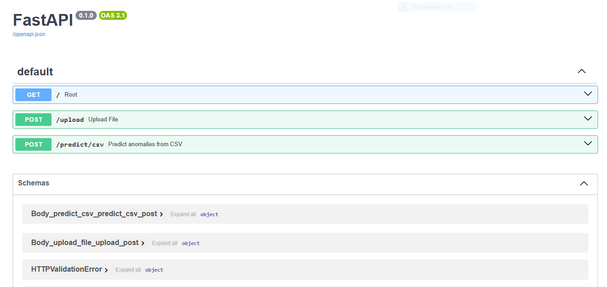
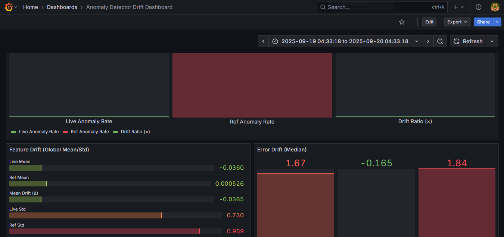

# End-to-End Anomaly Detection System

##  Project Overview

End-to-end anomaly detection system with deep learning, automated drift detection, and production monitoring. The system is modular, production-ready, and exposes a single API endpoint for real-time or batch inference.

It supports ensemble training (LSTM Autoencoder, GRU Autoencoder, CNN Autoencoder), drift detection (feature, error, anomaly), and full monitoring with Prometheus + Grafana. Deployment is containerized with Docker and runs on AWS infrastructure (ECR, S3, EC2) with CI/CD automation.


##  High-Level Architecture


##  Features

* **Training pipeline**: Ensemble of LSTM Autoencoder, GRU Autoencoder, CNN Autoencoder
* **Drift Detection**: Feature drift, reconstruction error drift, anomaly rate drift
* **Experiment Tracking**: MLflow for metrics, artifacts, and model registry
* **Monitoring**: Real-time inference metrics monitoring with Prometheus + Grafana dashboards
* **Deployment**: Dockerized services deployed on AWS (ECR, S3, EC2) via GitHub Actions CI/CD
* **Modular Stages**: Each pipeline stage emits clean, versioned artifacts (`.pkl`, `.json`, `.yaml`) for reproducibility
* **Bring Your Own Data (BYOD) Extension**: Users can upload raw CSVs to automatically train and deploy their own anomaly detection models


## System Architecture

### Interaction Between Stages — Full Pipeline Flow

1. **Data Ingestion → Preprocessing & Windowing**

   * **Output**:

     * `raw_df`: Raw time-series DataFrame
     * `ingestion_metadata.json`: Source, time range, feature metadata

2. **Preprocessing & Windowing → Model Training**

   * **Output**:

     * `X_train, X_val, X_test`: 3D numpy arrays (samples, time\_steps, features)
     * `y_train, y_val, y_test`: Reconstruction targets
     * `scaler.pkl`: Normalization object
     * `window_config.json`: Window/step size + split ratios

3. **Model Training → Evaluation**

   * **Output**:

     * Model weights (`lstm_ae.pth`, `gru_ae.pth`, `cnn_ae.pth`)
     * `training_logs.json`: Epoch-wise losses
     * Validation checkpoints

4. **Evaluation → Model Packaging**

   * **Output**:

     * `metrics.json`: AUC, thresholds, error stats
     * `best_model_name.txt`: Tracks best-performing model

5. **Model Packaging → Deployment API**

   * **Output**:

   ```
   Artifact/
   │
   ├── DataProcessing/
   │   ├── data_transform/        # Serialized transformations
   │   ├── dataset/               # Processed datasets
   │   ├── preprocessing_obj/     # Scalers / encoders
   │   ├── timestamp_data/        # Time index references
   │   └── window_config/         # Window/step configs
   │
   ├── model_dataloader/          # Dataloader logic + configs
   │
   ├── model_inference/
   │   ├── inference_metrics/     # Evaluation + drift metrics
   │   └── inference_results/     # Prediction outputs
   │
   └── model_training/            # Trained model weights + logs
   ```

6. **Deployment API → Drift Monitoring**

   * **Process**:

     * During **training**, **reference statistics** are saved (`ensemble_meta.json`) including:

       * Feature means, stds, histograms
       * Error distribution stats (median, p95)
       * Reference anomaly rate
     * During **inference**, **live metrics** are logged to `/metrics` endpoint via the Prometheus exporter.

   * **Integration**:

     * **Prometheus** scrapes live metrics (`prometheus.yml` config + `alert_rules.yml`)
     * **Grafana** queries Prometheus and visualizes **ref vs. live** on dedicated panels:

       * Feature Drift
       * Error Drift
       * Anomaly Rate Drift

##  Models & Ensemble Strategy

###  LSTM Autoencoder (LSTM-AE)

* **Architecture**:

  * Encoder: Stacked Long Short-Term Memory (LSTM) layers compress time-series sequences into a low-dimensional latent representation.
  * Decoder: Mirrors the encoder, reconstructing the original sequence from the latent space.
* **Strength**: Captures long-term temporal dependencies in sequential data, making it effective for datasets with strong seasonal or trend components.


###  GRU Autoencoder (GRU-AE)

* **Architecture**:

  * Encoder: Gated Recurrent Unit (GRU) layers encode sequences into latent vectors.
  * Decoder: Reconstructs sequences from the latent space.
* **Strength**: More computationally efficient than LSTM while still capturing temporal dependencies, especially effective when data has medium-range patterns.


###  CNN Autoencoder (CNN-AE)

* **Architecture**:

  * Encoder: Convolutional layers extract local temporal patterns from the time-series.
  * Decoder: Transposed convolutions reconstruct input windows from compressed features.
* **Strength**: Excels at detecting short-term local anomalies or sudden spikes/dips in the time-series.


###  Ensemble Technique — Error Aggregation & Ensemble

* Each model outputs a **reconstruction error per window** (MSE).
* Errors are **normalized** to a common scale using saved preprocessing rules.
* Aggregation rules combine the per-model errors into a **single ensemble score**.
* A **global threshold** is applied:

  * If ensemble score > threshold → `flag = 1` (anomaly)
  * Else → `flag = 0` (normal)

This ensemble approach balances the strengths of different architectures:

* LSTM for long-term patterns
* GRU for efficiency and mid-range dependencies
* CNN for local fluctuations

By combining them, the system reduces false positives and increases robustness across varied time-series types.


###  Feedback Loop Summary

```
raw_data.csv → ingestion → cleaned_df  
   ↓  
preprocessing → X splits + scalers  
   ↓  
model training → model.pt  
   ↓  
evaluation → metrics 
   ↓  
packaging → artifacts/  
   ↓  
API → loads artifacts, serves predictions  
```


###  Key Design Insights

* **Strict configuration management**  
  All hyperparameters, preprocessing rules, window sizes, and thresholds are tracked in versioned YAML configs. This ensures reproducibility, easier debugging, and smooth handoff between environments (local → staging → production).

* **Modular, decoupled pipeline**  
  Each stage of the system (ingestion, preprocessing, training, evaluation, inference, monitoring) is implemented as a standalone component. This design allows for independent execution, easier testing, and the ability to swap components (e.g., plug in a new model) without breaking the pipeline.

* **Unsupervised modeling with autoencoders**  
  Using reconstruction-based deep learning models (LSTM, GRU, CNN autoencoders) enables detection of anomalies without requiring labeled datasets. This makes the system robust to real-world, unlabeled time-series data.

* **Production-ready API architecture**  
  The FastAPI service is built to handle multiple use cases and can be extended with minimal changes. Clear separation of model artifacts, request handling, and monitoring endpoints ensures maintainability.

* **Monitoring-driven reliability**  
  Prometheus metrics and Grafana dashboards provide visibility into system health, anomaly trends, and data drift. This monitoring-first approach ensures the system can adapt to evolving data distributions and maintain accuracy in production.


###  BYOD (Bring Your Own Data) Extension

* New `/upload` endpoint for raw CSV ingestion
* Entire pipeline runs automatically → ingestion, preprocessing, training, evaluation, packaging
* User-specific artifacts stored for inference
* `/predict` loads models for real-time anomaly detection




## Tech Stack

* **Deep Learning**: PyTorch
* **Experiment Tracking**: MLflow
* **Monitoring**: Prometheus, Grafana
* **Containerization**: Docker
* **Cloud Deployment**: AWS (ECR, S3, EC2)
* **Automation**: GitHub Actions (CI/CD)


##  Setup Instructions

1. **Clone Repo**

   ```bash
   git clone https://github.com/your-org/anomaly-detector.git
   cd anomaly-detector
   ```

2. **Install Requirements**

   ```bash
   pip install -r requirements.txt
   ```

3. **Run Training Locally**

   ```bash
   python src\components\training_compt\model_training.py 
   ```

4. **Run Inference API**

   ```bash
   uvicorn app:app --reload --port 8000
   ```

5. **Run with Docker**

   ```bash
   docker build -t anomaly-detector .
   docker run -p 8000:8000 anomaly-detector
   ```

6. **Deploy to AWS (ECR + EC2)**

   * Push Docker image to ECR
   * Launch EC2 instance
   * Pull & run container
   * Connect with S3 for artifact storage


##  Usage Examples

### Training Command

```bash
python src\components\training_compt\model_training.py
```


### API Inference Example

```bash
curl -X POST "http://localhost:8000/predict" \
     -H "Content-Type: application/json" \
     -d '{"data": [[1.2, 3.4, 5.6, ...]]}'
```

**Response:**

```json
{
  "anomalies": [0, 1, 0, 0, 1],
  "scores": [0.02, 0.87, 0.1, 0.05, 0.92],
  "timestamps": ["2025-01-01T00:00:00Z", ...]
}
```


#  Drift Monitoring Setup

This project includes a **production-grade drift monitoring system** to track model stability over time. The monitoring stack combines **Prometheus** (metrics scraping and alerting) with **Grafana** (visualization dashboards).


##  What is Monitored?

The system compares **reference metrics** (from training/validation) with **live metrics** (from inference) to detect drift:

* **Feature Drift**

  * Mean and standard deviation of each feature (`feature_mean_ref` vs `feature_mean_live`, `feature_std_ref` vs `feature_std_live`).
  * Global feature statistics (`feature_global_mean_ref` vs `feature_global_mean_live`).

* **Error Drift**

  * Reconstruction error medians and percentiles (`error_median_ref` vs `error_median_live`, `error_p95_ref` vs `error_p95_live`).

* **Anomaly Drift**

  * Rate of anomalies detected during training vs inference (`anomaly_rate_ref` vs `anomaly_rate_live`).


## How it Works

1. **Metrics Exporter**

   * A Python service (`metrics_exporter.py`) exposes training reference metrics and live inference metrics at `/metrics`.
   * Runs alongside the anomaly detection pipeline (`uvicorn app:app --host 0.0.0.0 --port 8000`).

2. **Prometheus**

   * Scrapes metrics from the exporter every 15s.
   * Configuration defined in `prometheus.yml`.
   * Alerting rules (e.g., drift thresholds) are defined in `alert_rules.yml`.

   

3. **Grafana**

   * Connects to Prometheus as a data source.
   * Dashboards visualize **Ref vs Live** metrics over time:

     * Feature drift panel
     * Error drift panel
     * Anomaly drift panel

   


##  Key Files

* `metric_exporter/prometheus_exporter/metrics_exporter.py` → Exposes metrics.
* `prometheus.yml` → Prometheus scrape config.
* `alert_rules.yml` → Drift alert rules (e.g., error median doubled).
* `docker-compose.yml` → Brings up the full stack (pipeline, Prometheus, Grafana).
* `Dockerfile` → Builds the anomaly detection pipeline container.


## Workflow Summary

1. Start the pipeline → serves API + metrics on port **8000**.
2. Prometheus → scrapes metrics from pipeline exporter (port **9090**).
3. Grafana → visualizes drift dashboards (port **3000**).
4. Alerts trigger if live metrics drift significantly from reference metrics.


flowchart LR
    subgraph Pipeline["Anomaly Detection Pipeline"]
        A[app.py / uvicorn] --> B[Metrics Exporter<br>/metrics endpoint]
    end

    B -->|scrape every 15s| P[Prometheus<br>(prometheus.yml + alert_rules.yml)]
    P -->|Data Source| G[Grafana Dashboard]

    G -->|Panels| F1[Feature Drift]
    G -->|Panels| F2[Error Drift]
    G -->|Panels| F3[Anomaly Drift]

> Full walkthrough for the drift monitoring is covered in the [blog post](https://medium.com/@niranjosh011/going-beyond-local-mlops-in-the-cloud-9ec7db023423)


##  Lessons Learned

* **Modular design** made debugging, scaling, and extending the pipeline much faster.  
* **Strict artifact and config versioning** ensured reproducibility and smooth handoff across environments.  
* **MLflow tracking** was essential for experiment traceability and model comparison.  
* **Prometheus + Grafana integration** gave real-time observability into system health, drift, and anomalies.  

###  Key Challenges & Decisions

* **Deep learning model design** — building robust LSTM, GRU, and CNN autoencoders required careful tuning to balance accuracy vs. training time.  
* **Ensemble strategy** — deciding how to combine models (averaging vs. voting) was critical for reliable anomaly scoring.  
* **Drift detection design** — selecting thresholds and monitoring strategies that generalized well across datasets took several iterations.  

> Full walkthrough of the entire porject and how everything ties in together is covered in the [blog post](https://medium.com/@niranjosh011/going-beyond-local-mlops-in-the-cloud-9ec7db023423)


## Future Work

* Automated retraining triggered by detected drift
* Kubernetes deployment for large-scale workloads
* Real-time streaming pipeline for continuous data ingestion


